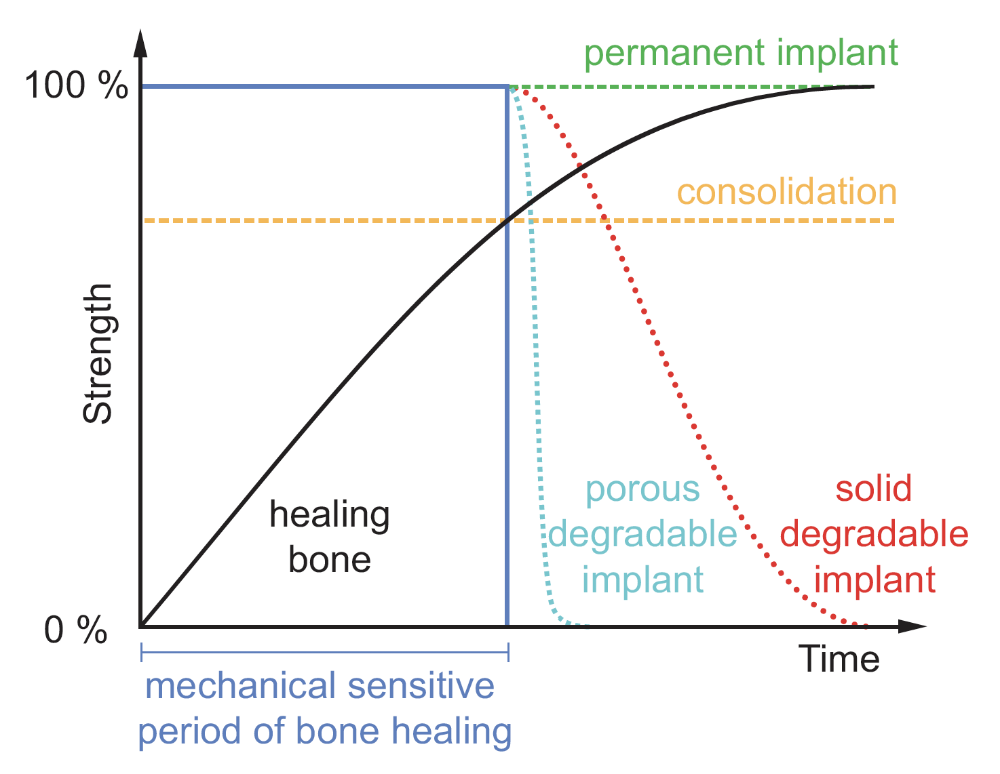

[**See my current publications here**](Publications)

## An Electrochemical Aptamer-Based Biosensor
I am currently based in the <a href="https://www.unsw.edu.au/science/our-schools/chemistry/our-research/our-research-groups/smart-materials-and-surfaces-group">Smart Materials and Surfaces Group</a> in the School of chemistry at the University of New South Wales, working with <a href="https://research.unsw.edu.au/people/scientia-professor-justin-gooding">Scientia Prof. Justin Gooding</a>. Our team is currently developing next generation electrochemical aptamer-based biosensors for [Nutromics](www.nutromics.com).

-01.png)

Nutromics are developing the first real-time, high-frequency molecular sensing technology that is both: (1) selective enough to work in situ in the living body and (2) independent of the chemical reactivity of its targets, thus rendering it is generalizable. Using this approach, they have demonstrated seconds or even sub-second resolve measurement of multiple drugs, metabolites and biomarkers in the plasma (veins), cerebrospinal fluid (brains) and interstitial fluid (subcutaneous space) of live rats.

I'm sorry, but the exact involvement in this project cannot be discussed at current time as it is currently undergoing the patent process which has not been finalized yet; however, I have linked some references at the bottom which might be of interest.

## Covalently-Bound Organic Modification of Transparent Metal Oxides

As a PhD student in the School of Physical and Chemical Sciences at the University of Canterbury, I worked with Prof. Alison Downard, Prof. Martin Allen, and Prof. Roger Reeves exploring the physical, chemical, and electronic properties and device applications of metal oxide semiconductors.

**The main areas of my project involved:**
1. Electrochemical and spontaneous modification of metal oxide surfaces
2. Nanofabrication of Schotty diodes
3. Computational analysis of the metal oxide surfaces before and after the attachement of aryl groups

<a href="https://ir.canterbury.ac.nz/handle/10092/104008/">Link to my PhD thesis.</a> Currently this is under embargo, however if you are interested I can send through a copy.

## Biomedical Magnesium

My Honours thesis project, under the supervision of Prof. Alsion Downard and Ass. Prof. Mark Staiger, focused on the development of a biocompatible layer to
decrease the corrosion properties of the biomedical magnesium.

*The mechanical strength of bone, permanent implants, and solid and porous degradable
implants as the bone heals. Consolidation is the point at which the stronger lamellar bone forms,
requiring pressure to form correctly. Modified from reference 13.*

A link to my thesis can be found here: [*Novel Coatings for Improving the Corrosion Resistance of Mg Biomedical Implants*](assets/Liam Carroll - Honours Thesis.pdf)

## References

* [www.nutromics.com](www.nutromics.com)
* [Kevin Plaxco's research group](https://plaxco.chem.ucsb.edu/)
